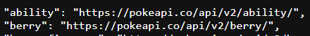
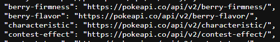
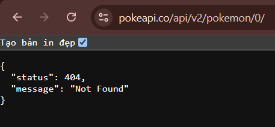
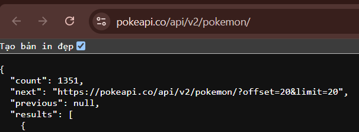

Review API "https://pokeapi.co/api/v2/" theo 9 tiêu chí:
1. Resources là danh từ, method diễn đạt hành động.

    Đạt yêu cầu

    Vd:

    
2. Naming lowercase, kebab-case path, snake_case query.

    Đạt yêu cầu

    Vd:

    

3. Endpoint depth ≤ 3; flatten với filter khi sâu hơn.

    Đạt yêu cầu

4. Treat POST as không-idempotent; PUT, DELETE idempotent.

    Chưa đạt yêu cầu

    Lý do: API công khai này chỉ hỗ trợ phương thức GET (Read-Only API)

5. Status code đúng nghĩa · không bao giờ trả 200 + error.

    Đạt yêu cầu

    Vd:

    

6. Error response theo RFC 7807 problem+json nhất quán.

    Chưa đạt yêu cầu

    Lý do: Eror response trả về không theo chuẩn RFC 7807 problem+json

7. Pagination: chọn offset, cursor hoặc keyset theo use case.

    Đạt yêu cầu

    Vd:

    

8. Hỗ trợ filter, sort, sparse fieldsets cho mọi collection.

    Chưa đạt yêu cầu

    Lý do: Chưa hỗ trợ sort, sparse fieldsets

9. Versioning từ ngày đầu; tài liệu deprecation rõ ràng.

    Đạt yêu cầu
