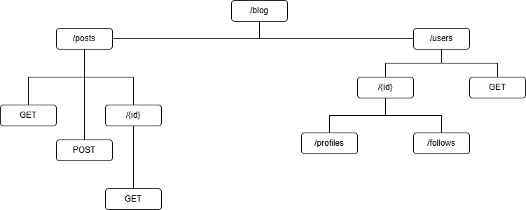
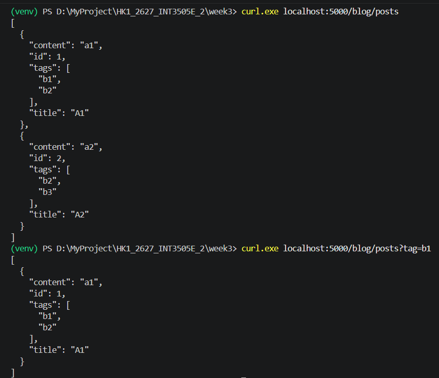
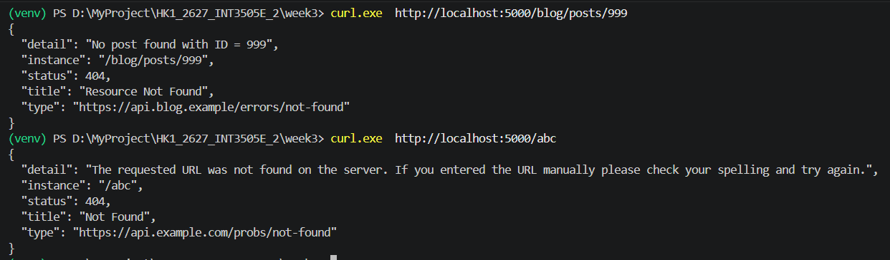
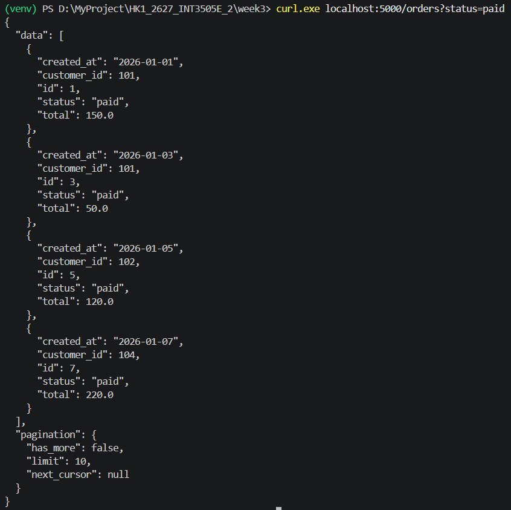
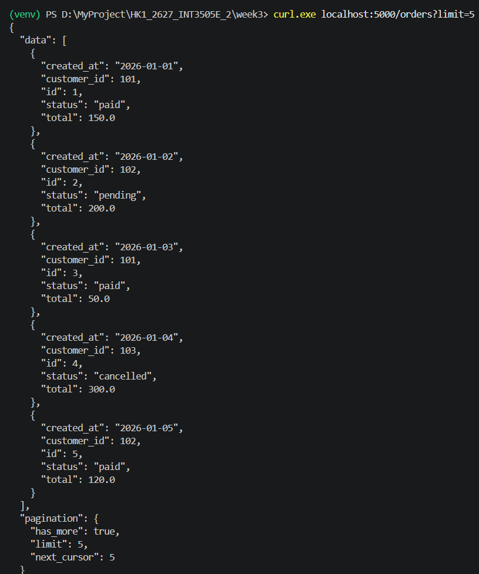
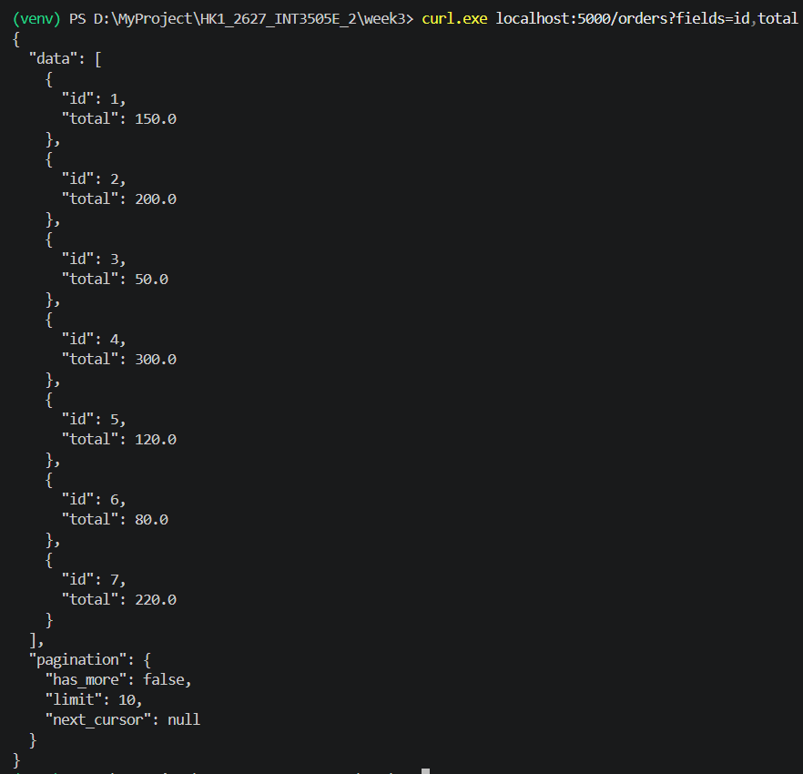
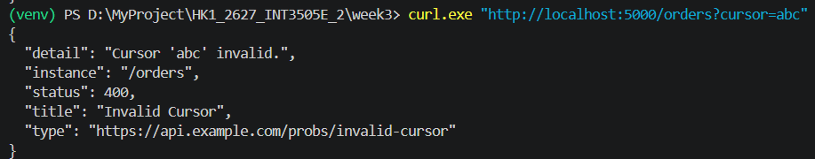

Bài 1

1.1.Xác định resources:

    posts: bài viết
    comments: bình luận
    tags: thẻ bài viết
    users: người dùng
    profiles: hồ sơ người dùng
    follows: theo dõi

1.2.Phân loại collection / item / sub-resource:

    Collection:
        /posts
        /users
        /tags
    Item:
        /posts/{id}
        /users/{id}
        /tags/{id}
    Sub-resource:
        /posts/{id}/tags
        /users/{id}/follows

1.3.Sơ đồ

1.4 kết quả chạy code

Bài 2

Bài 3
Test: curl 'localhost:5000/orders?status=paid'

Test: curl 'localhost:5000/orders?limit=5'

Test: curl 'localhost:5000/orders?fields=id,total'

Test: lỗi 400 Bad Request
